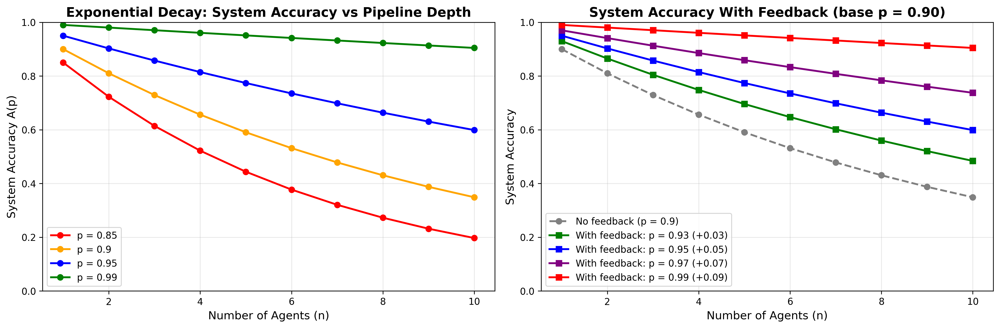

# Sequential Agentic AI Pipeline Reliability Analysis

This repository provides a mathematical and computational analysis of **how error compounds in multi-agent AI pipelines**, and how feedback-based mechanisms can significantly improve system performance.

## Overview

In agentic AI systems, multiple agents are arranged **sequentially** — where the output of one agent becomes the input of the next.  
Even if each agent is highly accurate individually, the **end-to-end accuracy degrades exponentially** as the pipeline gets deeper.

This repository explores:

- Mathematical analysis of sequential agent accuracy  
- Why compounding error happens  
- How feedback improves reliability  
- Simulation + visualizations  
- Strategies for designing robust agent pipelines  

## Mathematical Foundations

### **1. System Accuracy Formula**

For a pipeline of **n agents**, each with accuracy **p**:

\[
A(p) = p^n
\]

Meaning:

- 90% per agent over 5 agents → **59.05%**
- 90% per agent over 10 agents → **34.87%**

---

### **2. Derivative (Sensitivity)**

\[
A'(p) = n \cdot p^{n-1}
\]

Shows how system accuracy changes when a single agent improves.

---

### **3. Feedback Based Improvement**

If each agent improves by a small Δp:

\[
\Delta A \approx n \cdot p^{n-1} \cdot \Delta p
\]

Small improvements → **exponentially large system gains**.

---

## Key Insights

### **1. Compounding Error is Severe**
| Agents | Accuracy per Agent | System Accuracy |
|--------|---------------------|------------------|
| 5 | 90% | **59%** |
| 10 | 90% | **34%** |
| 5 | 80% | **32%** |

---

### **2. Feedback is the Optimal Solution**

Improving each agent even slightly results in exponential benefit:

\[
0.95^5 = 77.38\%
\]
vs  
\[
0.90^5 = 59.05\%
\]

This is a **31% improvement** from just +5% per agent!

---

### **3. Reducing Number of Agents Is Not Ideal**

Removing agents reduces functionality.  
Feedback increases reliability **without sacrificing capability**.

---

### **4. Best Feedback Techniques**
- Self-reflection  
- Verification  
- Multiple retries  
- Tool-assisted reasoning  
- Abstention (“I don’t know”)  

---

## Python Implementation

The script `Analysis.py` includes:

### `AgenticPipelineAnalyzer`
- Computes sequential accuracy  
- Sensitivity analysis  
- Exponential-decay simulation  
- Visualization generation  

### `FeedbackMechanism`
- Retry logic  
- Self-checking  
- Verification-based boosting  
- Ensemble of weak learners  

---

## Visualizations

The script produces a visualization showing exponential decay of accuracy with depth.

### **Pipeline Reliability Visualization**

